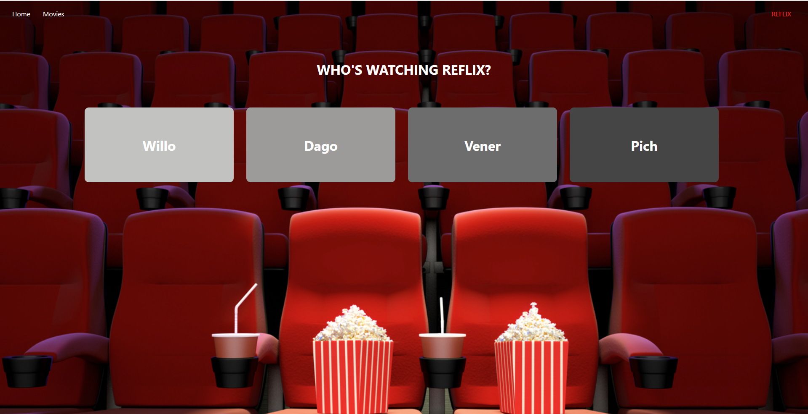
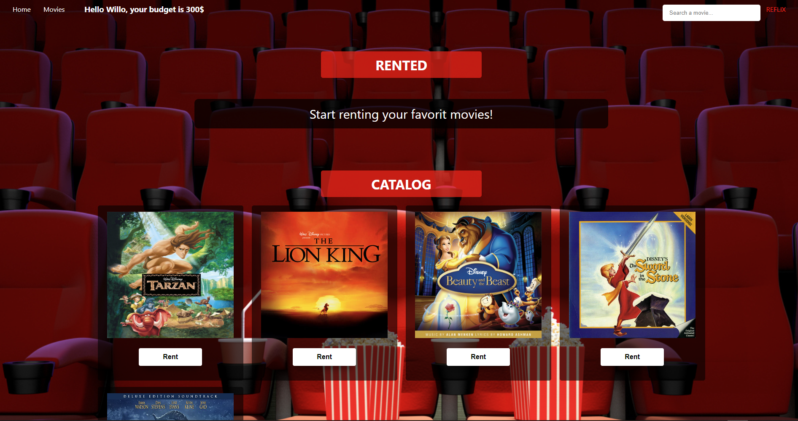
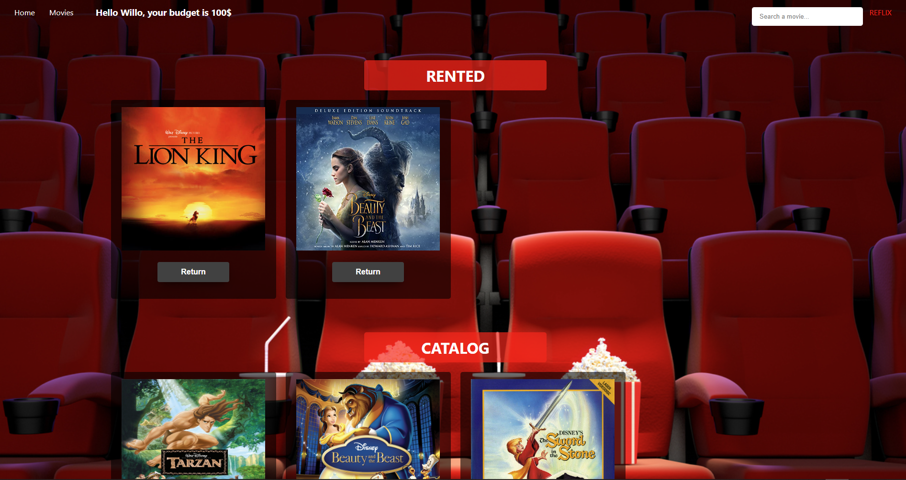
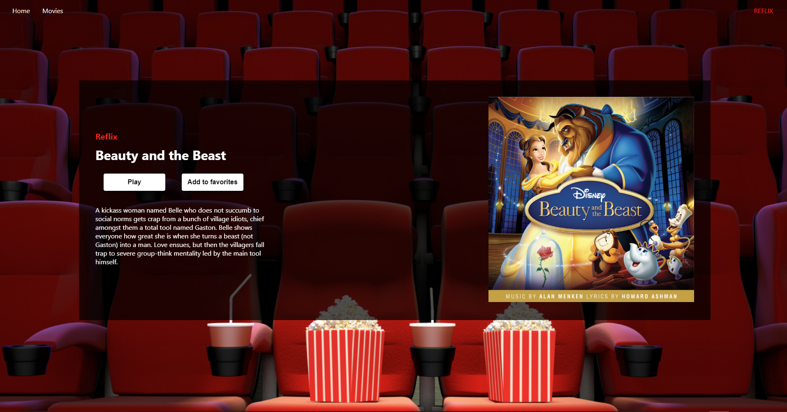
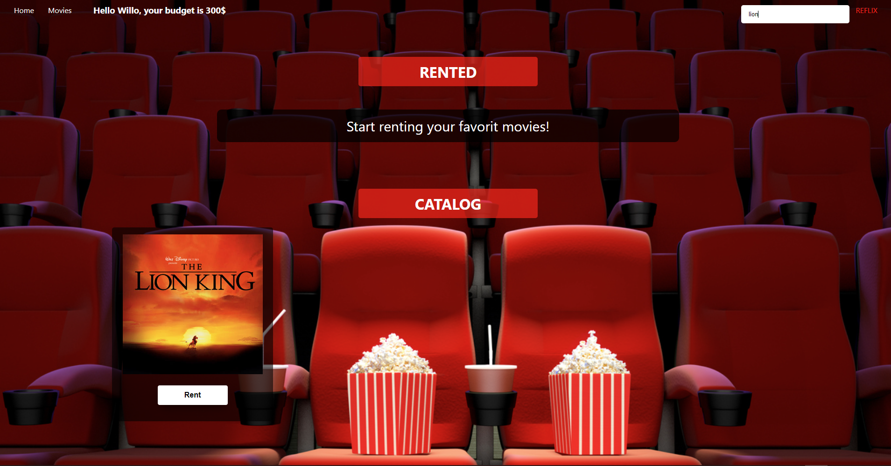

# REFLIX -netflix replica

This project is a very simple version of netflix

## Technologies

- React (class based)
- js
- css

### setup
use npm to install the project localy 

```
$ npm install
$ npm start
```

'npm start' Runs the app in the development mode.\
Open [http://localhost:3000](http://localhost:3000) to view it in your browser.

## Flow
home screen



user screen



The user can rent movies according to his budget



movies screen



The user can serach movies

